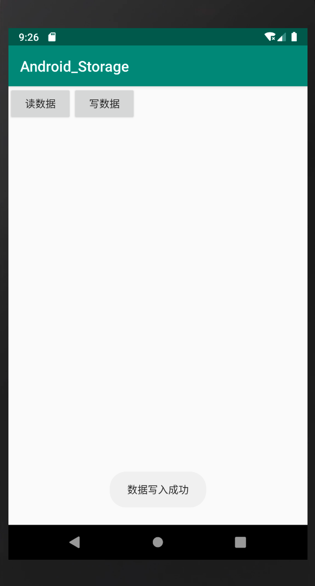
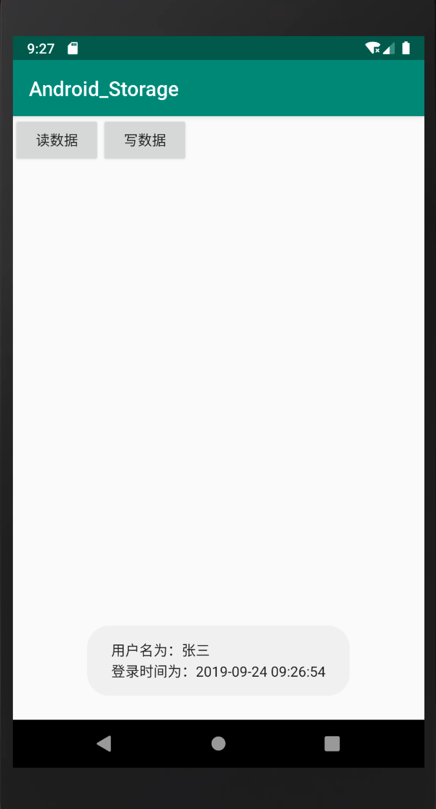
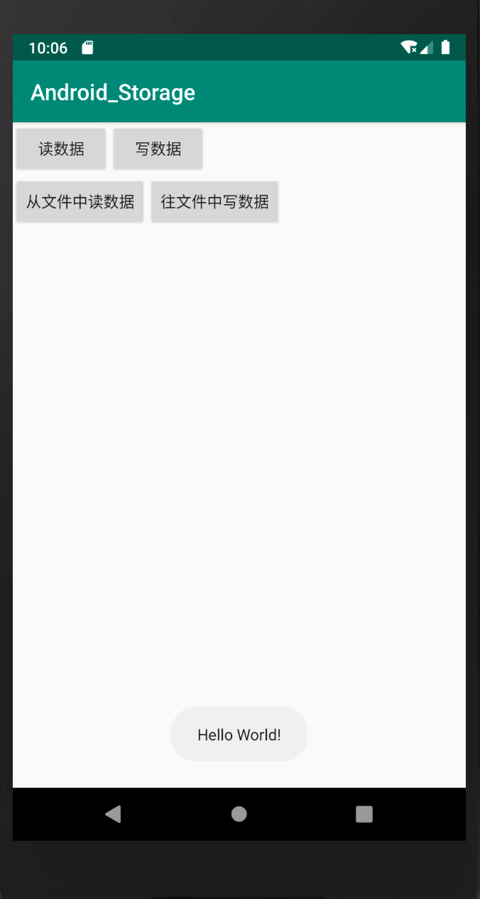

# 使用 `SharedPreferences` 进行数据的读写操作

## 读操作

```java
String userNameStr = sharedPreferences.getString(UserName, null);
String loginDateStr = sharedPreferences.getString(LoginDate, null);
if (userNameStr != null && loginDateStr != null) {
    Toast.makeText(MainActivity.this, "用户名为：" + userNameStr + "\n" + "登录时间为：" + loginDateStr, Toast.LENGTH_SHORT).show();
} else {
    Toast.makeText(MainActivity.this, "无数据", Toast.LENGTH_SHORT).show();
}
```

## 写操作

```java
SimpleDateFormat simpleDateFormat = new SimpleDateFormat("yyyy-MM-dd hh:mm:ss");
String LoginDateStr = simpleDateFormat.format(new Date());

editor.putString(UserName, "张三");
editor.putString(LoginDate, LoginDateStr);
editor.apply();
```

总结：在向edit中put完数据后一定要记得调用apply或者commit方法，提交你对数据的更改。
这个数据是写在物理存储上的，所以重启应用后写入的数据还是存在的。


效果图：






配置文件存储的位置：`/data/data/<PackageName>/shared_prefs/` 目录下

文件内容：

```xml
<?xml version='1.0' encoding='utf-8' standalone='yes' ?>
<map>
    <string name="UserName">张三</string>
    <string name="LoginDate">2019-09-24 09:34:19</string>
    <string name="Name">张三</string>
    <string name="STUDENT_ID">2017010695</string>
</map>
```

# 使用本地文件形式存储数据

## 读数据操作

```java
InputStream in = null;
try {
    FileInputStream fileInputStream = openFileInput(FILENAME);
    in = new BufferedInputStream(fileInputStream);
    int c;
    StringBuilder builder = new StringBuilder("");
    try {
        while ((c = in.read()) != -1) {
            builder.append((char) c);
        }
        Toast.makeText(MainActivity.this, builder.toString(), Toast.LENGTH_SHORT).show();
    } finally {
        if (in != null) {
            in.close();
        }
    }
} catch (Exception e) {
    e.printStackTrace();
}
}
```

## 写数据操作

```java
OutputStream out = null;
try {
    FileOutputStream outputStream = openFileOutput(FILENAME, MODE_PRIVATE);
    out = new BufferedOutputStream(outputStream);
    String content = "Hello World!";
    try {
        out.write(content.getBytes(Charset.defaultCharset()));
        out.flush();
    } finally {
        if (out != null) {
            out.close();
        }
    }
} catch (Exception e) {
    e.printStackTrace();
}
```


效果图：




